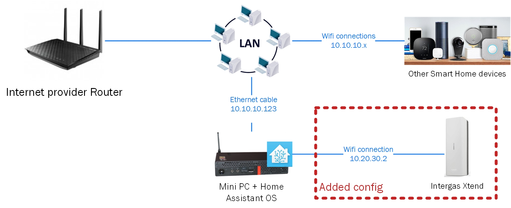
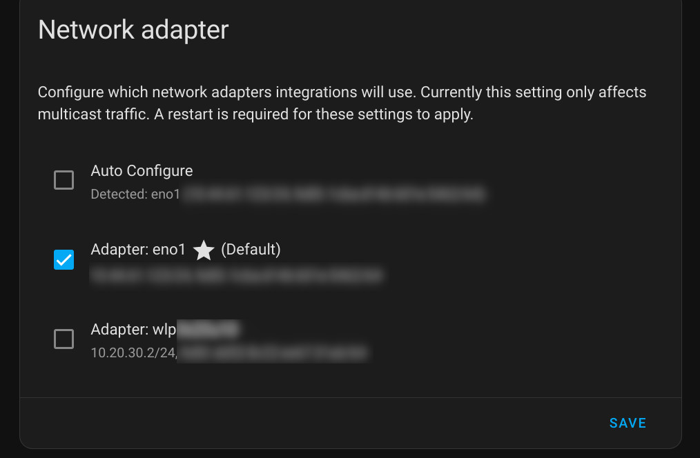
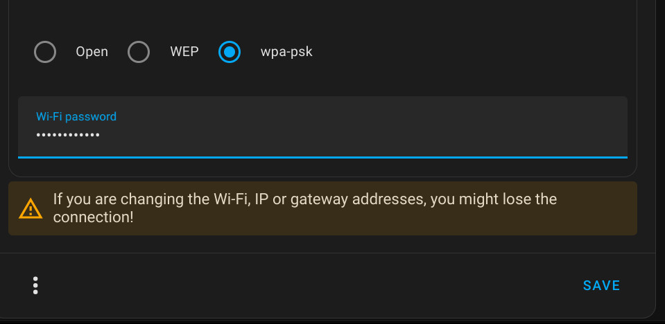
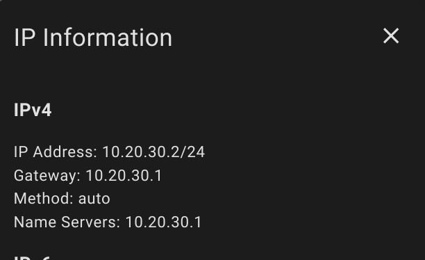
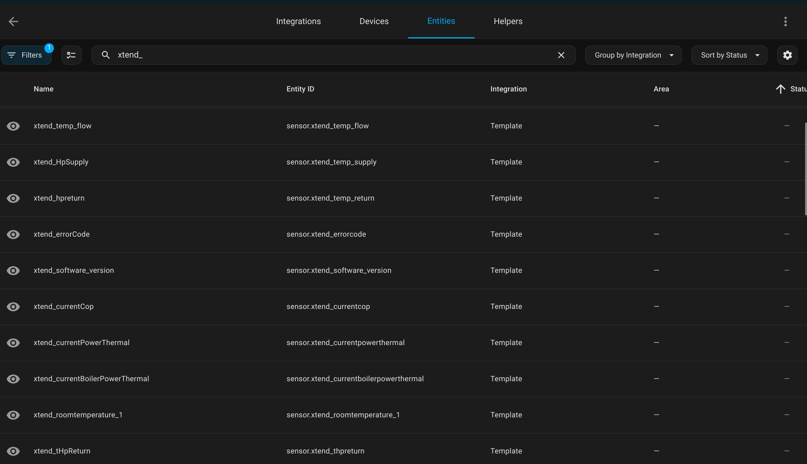
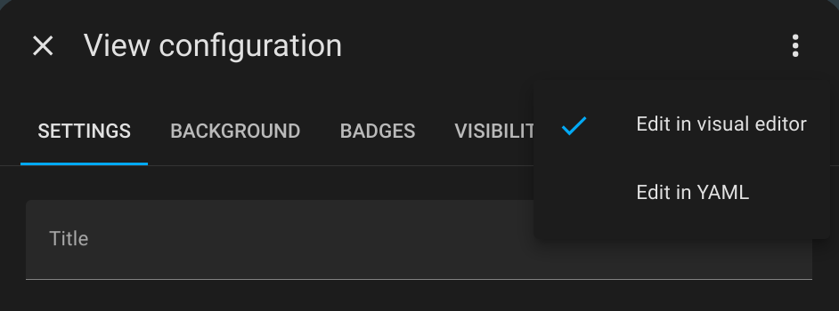
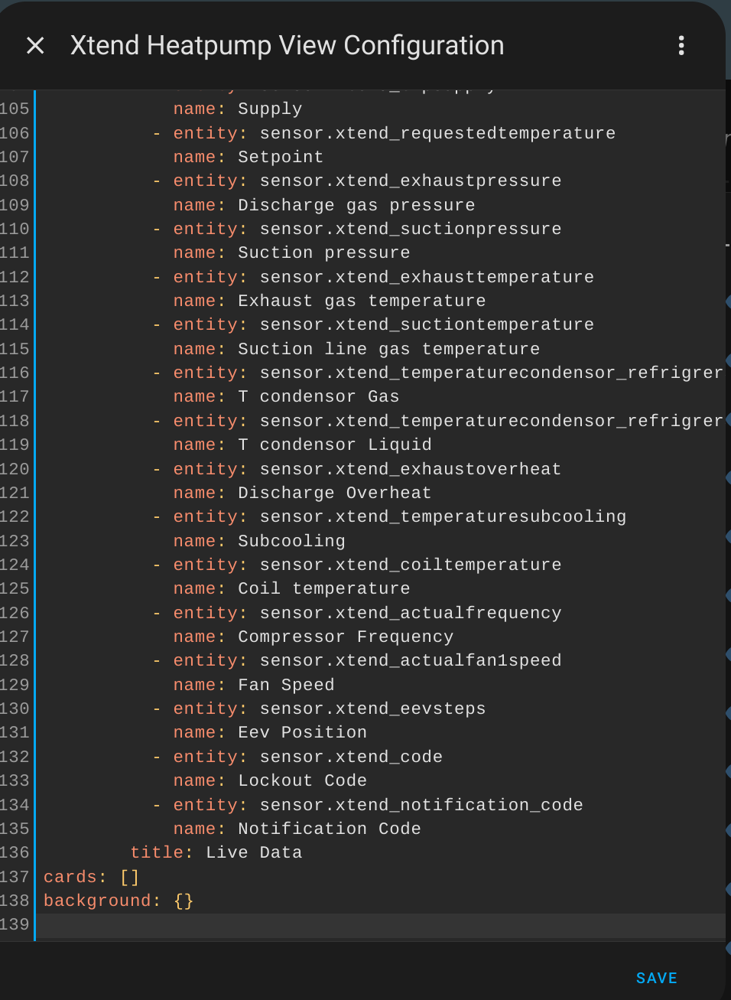

# HA_connection_Xtend

An HowTo article on connecting the Intergas Xtend hybrid heatpump to Home Assistant (HA) via wifi network adapter (multi homed) in three steps:

1. Connect HA to Xtend via Wifi
1. Configure HA templates for Xtend
1. Create a Xtend Dashboard

Hope it helps it in your journey.

## Connect HA to Xend via Wifi

The image below illustrates my setup at home. Your setup maybe different but the concepts still apply.



The device where HA is running needs to have at least two network devices:

1. _Ethernet adapter_ - recommended for default HA communication (see [HA installation doc](https://www.home-assistant.io/installation/raspberrypi#:~:text=Home%20Assistant%20can%20work%20with%20Wi%2DFi%2C%20but%20an%20Ethernet%20connection%20is%20more%20reliable%20and%20highly%20recommended.))
1. _WLAN adapter_ - to connect to the Xtend Wifi Access point.

In HA network adapters are automatically discovered and available in _Settings / System / Network_.


> [!NOTE]  
>
> * Make sure Home Assistant and the Xtend unit are within Wifi range of each other.
> * The IP-range of your LAN cannot overlap with 10.20.30.0/24
> * I disabled the auto-config on the HA Network Adapter section, because i suspect it from disabling the IP4 configuration of my wifi adapter. The configuration in the image below provides me with a stable connection with the Xtend.
> 

Follow these steps to connect HA to the Xtend:

* Press the button on the Xtend to activate the Wifi Access point (the LED blinks purple)
* In HA click on _Scan for Access points_, Select the network _Xtend_xxxxxxxxxx_
* Select _wpa-psk_ and typ the password (read the Xtend documentation where to locate your password)

  

* Click _Save_
* When connected succesfully the IP-information (behind the three dots) should look like this.

  

## Configure HA templates for Xtend

Next step is to extract the data from the Xtend API. To make it easy (for me) I split my HA configuration in different files. For more information read the article [Splitting the Configuration](https://www.home-assistant.io/docs/configuration/splitting_configuration/)

> [!NOTE]
> You can use the files in this repository in the Config folder or you can copy the content into your own HA configuration setup as you prefer.

### Sensor configuration

In the folder _/config/sensors/_ I configured my custom data sources in seperate yaml files. In my _configuration.yaml_ i changed the sensor line with this:

```yml
    sensor: !include_dir_merge_list sensors
```

This line combines all .yaml files in the _sensors_ folder into one configuration for sensors.

The sensor folder contains a .yaml file (e.g. [sensor_intergas_Xtend.yaml](config/sensors/sensor_intergas_Xtend.yaml)) with these lines:

```yml
- platform: rest
    name: Intergas_Xtend
    unique_id: 71298044-d08d-494c-a415-41a72b4a3aaa
    resource: http://10.20.30.1/api/stats/values?fields=7e06,79b3,7940,7921,50f2,503e,5041,5088,5077,63f0,63b3,63df,6a8e,6ac5,71a7,7160,777d,6a53,65b0,6579,7ed3,629c,6280,62e7,7767,65d9,6505,77c3,7e51,65c1,6cfb,6c33,65a7,6c8a,6578,6c66,62d1,7e2c,4133,6c53,6c26,6ceb,7ee6,7e81,7e31,47e0
    scan_interval: 120
    value_template: "OK"
    timeout: 30
    json_attributes:
        - stats
```

This sensor retrieves every 2 minutes (120 seconds) the specified sensordata from the Xtend API.

> [!NOTE]
> The fields in the URL above are the entities used on the Xtend dashboard described in a paragraph below. No need to request more fields then neccesary.
> There are a lot more fields available from the Xtend API. See the file [Known Xtend Codes](Known_Xtend_codes.md)

> [!TIP]
> Don't configure a scan interval above 300 (5 min). In my experience the wifi connection will disconnect due to inactivity and you need to repeat the previous paragraph, including climbing the stairs to push the button on the Xtend.
> Don't configure it too low as well or it will flood your HA database and (maybe) the storage capacity of your HA device.

To activate the sensor follow these steps:

* Copy the [sensor_intergas_Xtend.yaml](config/sensors/sensor_intergas_Xtend.yaml) in the config / sensors folder
* change the **sensor:** line in the _configuration.yaml_ as above
* In HA click on _Developer Tools_
* Click on _Check configuration_
* When it reports a green message like _Configuration will not prevent Home Assistant from starting!_ you can continue.
* Load the new configuration with _Restart HA_ (mandatory for changes in _configuration.yaml_).
* In _Developer Tools_ click on the Tab _States_ and filter on the name of the sensor, in my case _intergas_xtend_.
* You should get a result like the image below


### Template configuration

Now we have the Xtend sensordata in HA we need to make sense of it by seperating the values into seperate entities. This is where the templates come in.

Just like with the sensor configuration, I have the template files seperated by Data Source in a templates folder. In my _configuration.yaml_ the tempate line look like this:

```yml
    template: !include_dir_merge_list templates
```

The templates folder contains a .yaml file (e.g. template_intergas_Xtend.yaml) with lines like below. For the complete list of entities see [template_intergas_Xtend.yaml](config/templates/template_intergas_Xtend.yaml)

```yml
- sensor:
    - name: xtend_software_version
      unique_id: f2f4dfc0-0c38-4350-8463-7c1809a77dd1
      state: >
        {{ state_attr('sensor.Intergas_Xtend', 'stats')['47e0']}}

    - name: xtend_currentHpPowerThermal
      unique_id: 2d3ec316-ab0e-4e95-b909-2a80110f149b
      unit_of_measurement: "KW"
      state: >
        {{ state_attr('sensor.Intergas_Xtend', 'stats')['503e'] | float / 1000}}

    - name: xtend_currentCop
      unique_id: faa0c93c-5f46-4ff7-b9ce-bb609af880de
      state: >
        {{ state_attr('sensor.Intergas_Xtend', 'stats')['5041'] | float / 10 }}
```

To load this template in HA repeat the steps in the _Developer Tools_ like described in the paragraph _Sensor configuration_. You can also use the _Template entities_ button in the section _Developer Tools/YAML/YAML configuration reloading_.

When you succesfully load the template file you will see the entities appear in HA. It should look something like the image below.



## Create a Xtend Dashboard

So far so good .... it's time to use the obtained data in a dashboard.

> [!NOTE]
>
> * This example dashboard is inspired by the Statistics page on the Xtend webinterface. As noted before it is possible to retrieve other fields from the Xtend API and present these on the Xtend dashboard.
> * The dashboard is created on HA 2024.7.x and uses the new (experimental) Section View Type. Read the [HA blog](https://www.home-assistant.io/blog/2024/03/04/dashboard-chapter-1) for more info.
> * This dashboard uses a custom Card from HACS: [custom:bignumber-card](https://github.com/custom-cards/bignumber-card) Install this integration before importing the Dashboard code.
> * I haven't got time to get to the boiler information yet.
> * The Xtend provide a weird value of **327,67** for pressures and temperatures. I made an appointment with the installer to investigate.

My Xtend Heatpump dashboard looks like this.


> [!NOTE]
> These screenshots are taken just after the Xtend was installed in Summer!. The CoP of 11 is a result of some test runs and not a realistic value. :sunglasses:

Follow these steps to import this dashboard in your HA.

* Open the Overview page in HA and click on the pencil in the top right corner (Edit Dashboard)
* Click on the plus-sign to add a new dashboard
* In the new window _View Configuration_ click on the three-dot menu in the top right corner and select _Edit in YAML_
  
* Copy the text from [Xtend_Dashboard.yaml](Xtend_dashboard.yaml) and Paste the yaml code in the _View configuration_ Window
  
* Click on _Save_
* Click on _Done_

I hope this article has helped you monitor your Xtend's performance in a convenient way in Home Assistant.

## Background

In july 2024 my Intergas Xtend Hybrid Heat pump was installed. In anticipation off the installation I did some research on the internet on how I could connect the Xtend to Home Assistant. The solution described in https://github.com/thomasvt1/xtend-bridge didn't appeal to me because of the added devices and cables required. That said the code in that repository provided a lot of information I used to configure my own, more HA native, setup.

I am by no means a HA expert and gather and borrow information from the internet. This solution may not be as elegant but I lack the skills to develop a proper HA Integration; As the saying goes: _Make do with what you have_
Recommendations and/or improvements are welcome.

### My HA setup

I run HA on a refurbished Lenovo Thinkcenter (i3-4160T/8GB/256SSD/W10) with an external USB Wifi adapter. I removed the Windows OS and installed it with HAOS according to this article.
https://www.home-assistant.io/installation/generic-x86-64.

For the adjusting the config files in HA I installed the [VS Code Server](https://github.com/hassio-addons/addon-vscode) Add-On.
